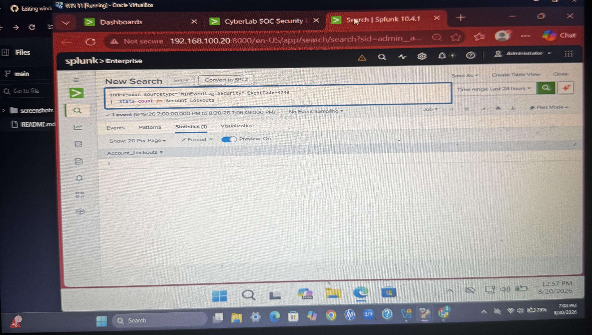

# 🔐 Windows Brute Force Detection & Investigation with Splunk

## Project Overview

This project demonstrates a hands-on Security Operations Center (SOC) investigation using Splunk Enterprise and Windows Security Event Logs.

The objective was to simulate repeated failed authentication attempts against a Windows domain user, ingest the resulting security events into Splunk, create a detection rule for potential brute-force activity, and investigate the authentication activity.

During the investigation, Windows Event ID 4625 (Failed Logon), Event ID 4624 (Successful Logon), and Event ID 4740 (Account Lockout) were analyzed to identify and correlate suspicious authentication behavior.


## Lab Objectives

- Generate failed Windows authentication attempts in a controlled lab environment
- Collect and analyze Windows Security logs using Splunk Enterprise
- Identify failed authentication events using Event ID 4625
- Identify account lockout activity using Event ID 4740
- Build an SPL query to detect repeated login failures
- Create a scheduled Splunk alert for possible brute-force activity
- Investigate the events associated with the triggered alert
- Correlate failed logins with successful logins using Event IDs 4625 and 4624
- Document the investigation as a SOC analyst workflow

## Technologies Used

- Splunk Enterprise 10.4.1
- Windows 11
- Windows Security Event Logs
- Active Directory
- Oracle VirtualBox
- Splunk Search Processing Language (SPL)

## Lab Environment

The lab uses a virtualized Windows environment with centralized security-event monitoring through Splunk.

Authentication activity from the Windows system is collected and indexed in Splunk, allowing failed and successful login events to be searched, correlated, and used for alerting.

**Key Windows Security Events:**

- **Event ID 4625** — An account failed to log on
- **Event ID 4740** — A user account was locked out
- **Event ID 4624** — An account was successfully logged on

## Brute-Force Detection

Windows authentication events were analyzed in Splunk to identify repeated failed login attempts against the domain account `jsmith`.

The investigation identified:

- **23 failed login attempts**
- **2 successful login events**
- Failed authentication activity identified using **Event ID 4625**
- Account lockout event identified using **Event ID 4740**
- Successful authentication activity identified using **Event ID 4624**

The repeated authentication failures, account lockout, and subsequent successful authentication demonstrate suspicious behavior that warrants further investigation by a SOC analyst.

## SPL Detection Query

The following Splunk Search Processing Language (SPL) query was used to correlate failed and successful authentication activity:

```spl
index=main sourcetype="WinEventLog:Security" (EventCode=4625 OR EventCode=4624)
| mvexpand Account_Name
| search Account_Name="jsmith"
| eval Failed=if(EventCode=4625,1,0)
| eval Successful=if(EventCode=4624,1,0)
| stats sum(Failed) AS Failed_Attempts sum(Successful) AS Successful_Logins earliest(_time) AS First_Event latest(_time) AS Last_Event by Account_Name
| convert ctime(First_Event) ctime(Last_Event)
| table Account_Name Failed_Attempts Successful_Logins First_Event Last_Event
```
### Failed Login Evidence — Event ID 4625

The following Windows Security event demonstrates the failed authentication activity analyzed during the investigation.

.jpg)

### Account Lockout Evidence — Event ID 4740

Windows Security Event ID 4740 indicates that a user account was locked out. Splunk identified one account lockout event during the investigation, providing additional evidence consistent with repeated authentication failures.



### Authentication Correlation — jsmith

The following evidence shows authentication activity associated with the jsmith account, correlating the failed and successful login events.

.jpg)

### Detection Results

The final Splunk detection correlated the authentication activity and identified 23 failed login attempts followed by 2 successful logins for the jsmith account.

.jpg)

## SOC Analyst Findings

The investigation identified suspicious authentication activity associated with the `jsmith` account. Analysis of Windows Security logs in Splunk revealed 23 failed login attempts, an account lockout event (Event ID 4740), followed by 2 successful authentication events.

The high number of failed authentication attempts may indicate attempted password guessing or brute-force activity. The account lockout provides additional evidence of repeated authentication failures, while the subsequent successful logins increase the importance of the activity because they could indicate that valid credentials were eventually obtained.

However, successful authentication following failed attempts does not by itself confirm account compromise. Additional investigation would be required to determine whether the activity was malicious or legitimate.

### Recommended Response Actions

- Investigate the source IP address associated with the authentication attempts.
- Review additional activity performed by the `jsmith` account after the successful login.
- Verify whether the successful authentication was legitimate with the account owner.
- Reset the account password if compromise is suspected.
- Review the system for additional indicators of compromise.
- Review and tune the Splunk alert threshold for repeated Event ID 4625 failures and subsequent Event ID 4624 successful authentication.

## Skills Demonstrated

- Splunk Enterprise
- Splunk Search Processing Language (SPL)
- Windows Security Event Analysis
- Event ID 4625 (Failed Logon)
- Event ID 4740 (Account Lockout)
- Event ID 4624 (Successful Logon)
- Authentication Log Correlation
- Brute-Force Detection
- SIEM Alerting
- Security Event Investigation
- SOC Analyst Workflow
- Incident Documentation
